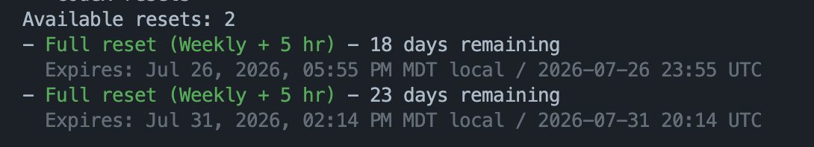

# codex-resets

Show available banked Codex rate-limit resets and expiry dates from the command line.

This is for Codex users signed in with a ChatGPT plan such as Plus, Pro, Business, or Enterprise.

Codex's built-in `/usage` can show current usage, but reset-credit expiry dates are hard to inspect quickly. This utility reads your local Codex ChatGPT auth file, calls the same ChatGPT reset-credit endpoint, and prints available resets sorted by soonest expiry.



## Prerequisites

- Codex CLI installed and signed in with ChatGPT auth
- `python3` available on your PATH
- Network access to `chatgpt.com`
- A readable Codex auth file at `~/.codex/auth.json` containing ChatGPT session tokens

Works on macOS and Linux. Windows users should use WSL.

If you are signed in through Codex with a ChatGPT plan, the needed ChatGPT tokens are already stored in `~/.codex/auth.json`. API-key-only auth may also create an auth file, but it does not provide the ChatGPT session token this endpoint needs.

## Install

Run the installer:

```bash
./install
```

This copies `codex-resets.py` to `~/.codex/codex-resets` and makes it executable. If a file already exists there, the installer creates a timestamped backup first.

Optional shell function:

```bash
codex-resets() {
  ~/.codex/codex-resets "$@"
}
```

Add that function to `~/.zshrc` or `~/.bashrc` if you want to run `codex-resets` from any terminal.

## Usage

Run directly:

```bash
~/.codex/codex-resets
```

Or, if you added the shell function:

```bash
codex-resets
```

The output shows available resets sorted by soonest expiry, with days remaining plus local and UTC expiry times.

## Test with sample data

```bash
./codex-resets.py --file resets.sample.json
```

## Color

The script colors reset titles by urgency when stdout is a terminal:

- Red: under 3 days remaining
- Yellow: under 7 days remaining
- Green: 7 or more days remaining

Use `--color` to force color and `--no-color` to disable it.

## Security note

The script reads your local Codex auth file to get the ChatGPT session token and sends that token only to `chatgpt.com` for the reset-credit request. It does not print, store, or send your token anywhere else.

## Troubleshooting

**`codex-resets: file not found: ~/.codex/auth.json`**
Sign in to Codex first, then rerun the script.

**`access token not found`**
Your Codex auth file exists, but it does not contain ChatGPT auth tokens. Sign in with ChatGPT auth rather than API-key-only auth.

**Network or DNS errors**
Check your internet connection, VPN, proxy, or firewall. The script needs to reach `https://chatgpt.com/backend-api/wham/rate-limit-reset-credits`.

**No resets shown**
The endpoint returned no currently available reset credits for your account.

## Uninstall

```bash
./uninstall
```

If you added the optional shell function, remove it from your shell profile too.
